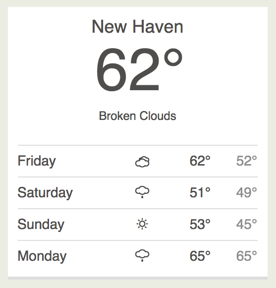

> **NOTICE** This package no longer works as intended, the endpoint it uses no longer exists

# Laravel Weather

[](https://packagist.org/packages/torann/laravel-weather) [](https://packagist.org/packages/torann/laravel-weather)

Just a simple weather package for Laravel.

----------

## Installation

- [Laravel Weather on Packagist](https://packagist.org/packages/torann/laravel-weather)
- [Laravel Weather on GitHub](https://github.com/torann/laravel-weather)

To get the latest version of Laravel Weather simply require it in your `composer.json` file.

~~~
"torann/laravel-weather": "0.1.*@dev"
~~~

You'll then need to run `composer install` to download it and have the autoloader updated.

Once installed you need to register the service provider with the application. Open up `app/config/app.php` and find the providers key.

```php
'providers' => [
    'Torann\LaravelWeather\ServiceProvider',
]
```

> **NOTE:** the is automatically registered during boot.

### Publish package assets:

```
$ php artisan asset:publish torann/laravel-weather
```

Add the following to the page where the Laravel Weather widget script will be active:

```
{{ HTML::style('/packages/torann/laravel-weather/weather.css') }} 
```

If using [Duct](https://github.com/torann/asset-duct) add this to the CSS manifest file:

```
 *= require torann/laravel-weather/weather.css
```

## Rendering

Rendering weather by point:

```
Weather::renderByPoint($lat, $lng)
```

Rendering weather by city name:

```
Weather::renderByName('Hamden, CT')
```

## Example

An live example can be seen on [Snowcrew.org](http://snowcrew.org)


